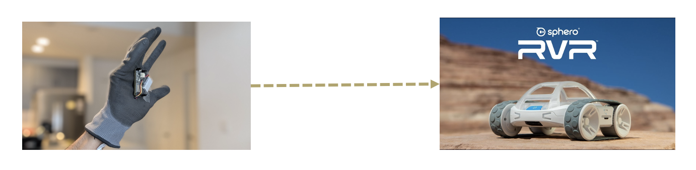
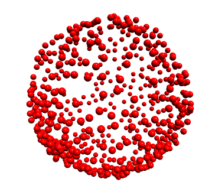
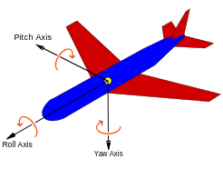

# Gesture-Controlled-Robot



## What and how?
We present a car that we can control using just our hand movements, instead of a remote.

- Gathered real-time readings (Gyro, Mag, Acc.) from the IMU sensors (LIS3MDL and LSM6DSOX), and did an initial calibration using [MotionCal](https://learn.adafruit.com/adafruit-sensorlab-magnetometer-calibration/magnetic-calibration-with-motioncal) .

<div align="center">
  
</div>

- Converted the extracted readings from sensors into yaw, pitch and roll data. 

<div align="center">
  
</div>

- Inferred orientation of hand according to sensor readings ([IMU readings visulation in Processing.org](./media/vid1.mp4))

- Relayed orientation info to Robo car using ESP32 WIFI module and API server on Raspberry Pi (Robo car).
- Converted orientation info to commands for the Sphero car, accurately scaling the speed and direction in car’s frame of reference. Used Sphero SDK to send commands to the robot.
- Fine tuned the processing pipeline to reduce latency and increase sensitivity in motion/rotation.

Some challenges and solutions:
- Sensor readings can be too sensitive to determine the orientation of hand movements: Used AHRS (Attitude and Heading Reference System) filter to remove ambient noise and help in conversion of IMU readings to Roll, Pitch and Yaw values ([Tutorial](https://learn.adafruit.com/how-to-fuse-motion-sensor-data-into-ahrs-orientation-euler-quaternions/overview)).
- Converting the palm orientation to robot movements: Scaled and bounded the raw readings so that commands are converted to robot’s frame of reference, easing the control. For example, the raw pitch readings from -90 to 90 were converted to 0 to 255 for the robot’s speed, with bounds ignoring changes of +/- 25.
- Magnetometer readings are sensitive to ambient magnetic fields (causing fluctuations): We used the roll data inferred from the gyroscope readings (do not depend on magnetometer readings) to calculate the direction of motion of the car.


## Experimental setup

### Step1: Network setup
Host the Raspaberry-Pi and the ESP32 on the same Wifi network.

### Step2: IMU and ESP32 module
Load the `send_imu_data` Arduino programs on the microcontroller with the correct Wifi SSID and password for communicating with the RasPi.

### Step3: Raspaberry-Pi connected to the Sphero RVR
Run the python script to start API server. The RasPi receives roll, pitch and yaw data from the IMU, computes the orientation, and sends commands to the Sphero for appropiate motion.
```bash
python3 server.py
```
The Sphero RVR moves based on the gestures, Hooray!

### Quick Demo

[Our Robot](./media/vid1.mp4) 

[Forward/Backward motion](./media/vid2.mp4)

[Side-to-Side motion](./media/vid3.mp4)

## Team 
- [Kalit Inani](https://github.com/Kalit31)
- [Keshav Kabra](https://github.com/everlearner)
- [Prabhav Gupta](https://github.com/PrabhavGupta24)


## License
Shield: [![CC BY 4.0][cc-by-shield]][cc-by]

This work is licensed under a
[Creative Commons Attribution 4.0 International License][cc-by].

[![CC BY 4.0][cc-by-image]][cc-by]

[cc-by]: http://creativecommons.org/licenses/by/4.0/
[cc-by-image]: https://i.creativecommons.org/l/by/4.0/88x31.png
[cc-by-shield]: https://img.shields.io/badge/License-CC%20BY%204.0-lightgrey.svg